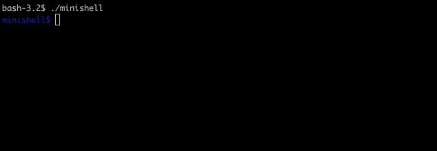

# minishell

Minishell is a basic bash program implemented in C. It provides functionality for executing commands, handling redirections and pipes, expanding environment variables, and implementing built-in commands such as `cd`, `echo`, `env`, `exit`, `export`, `pwd`, and `unset`.



## About the project

The Minishell project aims to create a simplified version of a shell, offering users a command-line interface to interact with the operating system. By implementing core shell features and built-in commands, developers gain a deeper understanding of system programming and shell functionalities.

### Project features

- Execute commands and programs.
- System executables available from the environment (`ls`, `cat`, `grep`, etc.)
- Implement pipes (`|`) to chain commands together.
- Support for input/output redirection (`<`, `>`).
    - `>` redirects the output.
    - `>>` redirects the output in append mode.
    - `<` redirects input
    - `<< DELIMITER` prompts for input until DELIMITER is reached, redirecting it to the command without updating history.
- Expand environment variables (e.g., `$HOME`, `$PATH`).
    - `$USER` expands the variable.
    - `"$USER"` expands the variable.
    - `'$USER'` doesnt expand the variable.
- Handle built-in commands such as `cd`, `echo`, `env`, `exit`, `export`, `pwd`, and `unset`.
- Implement signal handling to manage interrupts and signals gracefully:
    - `ctrl-c` displays a new prompt line.
    - `ctrl-d` exits minishell.
    - `ctrl-\` does nothing. 
- Error handling
  
## Running the project

To run the project, first clone the repository and navigate into the project directory. Then, use the `make` command to compile the project.

Once the project is compiled, you can run it with the following command:

```bash
./minishell

Then, you can interact with the Minishell and execute commands as you would in a standard shell. Some examples below:

1. Change directory:
``` bash
  cd /path/to/directory
```

2. Execute a program:
``` bash
./program_name
```

3. Pipe commands together:
``` bash
command1 | command2
```

4. Redirect input/output:
``` bash
command < input_file > output_file
```

5. Set and export variables:
``` bash
export VARIABLE_NAME=value
```
---
Made by [dardangerguri](https://github.com/dardangerguri) and [jhesso](https://github.com/jhesso).
